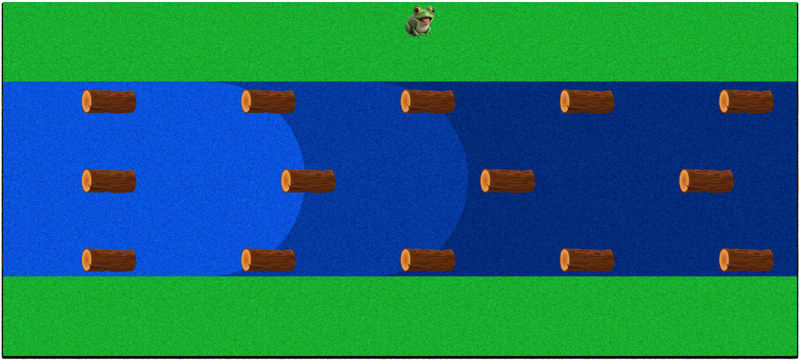
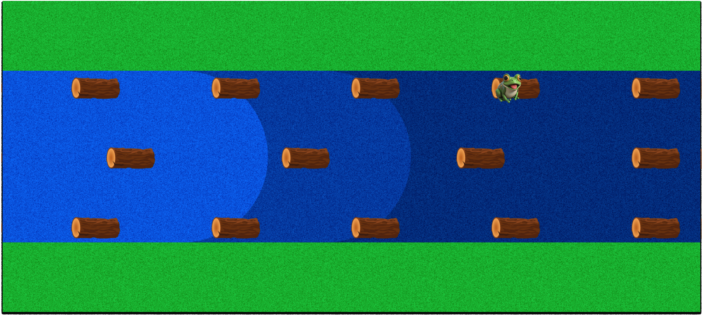
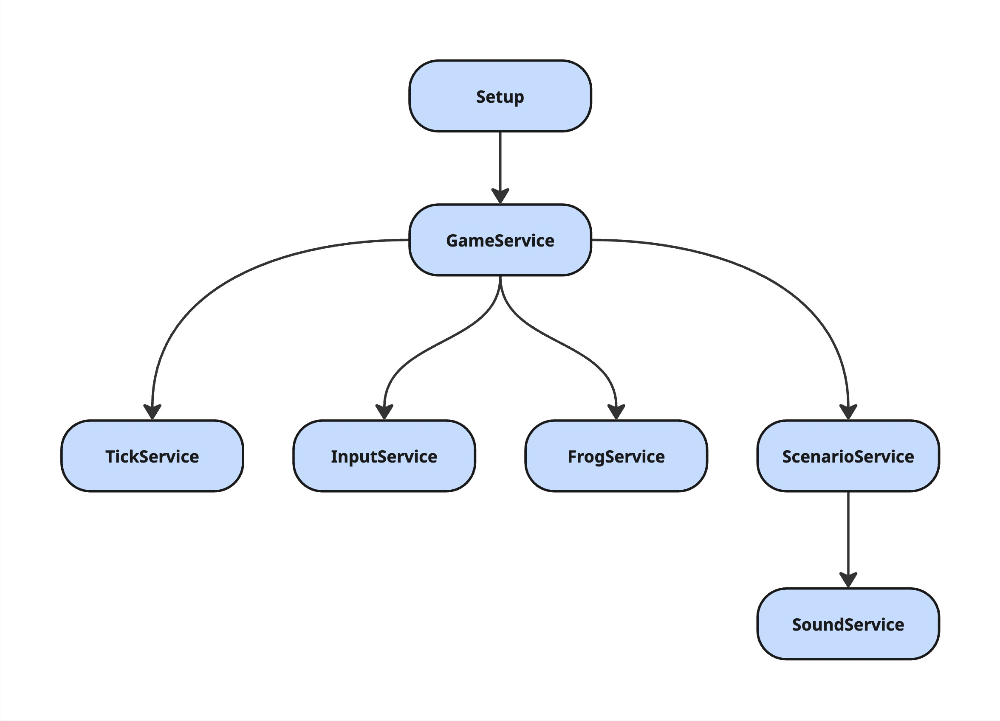

# Frogger Reborn

## 👨‍💻 Equipo de desarrollo

- Diego Contreras
- Thomas Barenghi

## 📸 Capturas




## 🎮 Reglas de Juego / Instrucciones

- El objetivo es ayudar a la rana a cruzar el río saltando sobre troncos móviles sin caer al agua.
- La rana avanza **de dos filas por vez** hacia arriba, empezando desde la parte inferior del escenario.
- Hay **troncos que se mueven** a distintas velocidades y direcciones en varias filas.
- Si la rana cae al agua o queda en un espacio sin tronco, pierde.
- Al llegar a la parte superior del escenario (zona segura), el jugador gana.

**Controles:**

- Usa las flechitas y movete por el escenario

## 🧾 Otros

- **Curso/Facultad:** UNAHUR, PROGRAMACION CON OBJETOS I
- **Versión de Wollok:** VSCODE Wollok Cli 0.3.1
- **Licencia:** Una vez terminado, no tenemos problemas en que el repositorio sea público.

# Documentación técnica

Esta guía resume la arquitectura del proyecto y explica, a grandes rasgos, las áreas que lo componen para que cualquier persona externa pueda leer el código y extenderlo sin dificultad.

---

## 1. Visión general

La aplicación recrea el clásico *Frogger*: el jugador mueve una rana y debe cruzar un río saltando sobre troncos en movimiento.

## 2. Estructura de carpetas (núcleo del código)

```
src/
 ├── config/         → Configuración y estado global (StateManager)
 ├── model/          → Entidades visuales/dominio (Frog, Log, Stage…)
 ├── service/        → Lógica de aplicación (GameService, SoundService…)
 ├── utils/          → Utilidades y recursos (constants, logger…)
```

## 3. Descripción de módulos

| Módulo / Servicio | Propósito principal | Colabora con |
|-------------------|---------------------|--------------|
| `GameService`     | Orquestador global. Inicia/pausa/resetea juego, coordina ticks y transiciones. | Todos los servicios, `StateManager` |
| `StateManager`    | Fuente de la verdad: nivel, vidas, puntos, flags de estado. | Resto de servicios |
| `InputService`    | Mapea teclas a acciones (enter, flechas, R, P, Q). | `GameService` |
| `TickService`     | Programa acciones periódicas (mover troncos, chequear rana). | `GameService` |
| `FrogService`     | Movimiento, validación y detección de peligro para la rana. | `StateManager` |
| `ScenarioService` | Renderiza HUD, troncos, pantallas (welcome, pause, win, lose). | `SoundService`, `StageFactory`, `StateManager` |
| `SoundService`    | Controla música de fondo, efectos y sonidos de estado. | `StateManager` |
| `StageFactory`    | Construye la lista de troncos/bonus por nivel. | `constants` |
| `constants`       | Valores inmutables: dimensiones, rutas de recursos, timers. | Todo el proyecto |

---

## 4. Flujo de ejecución (ciclo de vida)

1. **Arranque**  
   `GameService.initialize()`  
   - Muestra pantalla de bienvenida.  
   - Prepara controles y ticks (sin iniciarlos).

2. **Start (Enter)**  
   `InputService` → `GameService.startGame()`  
   - `StateManager.startGame()` pone el juego “en progreso”.  
   - `ScenarioService.renderStage()` dibuja HUD, troncos, rana.  
   - `TickService.playTicks()` comienza los ciclos.

3. **Loop de ticks**  
   - `handleMoveLogs` → mueve troncos, arrastra rana si corresponde, incrementa puntos y evalúa caídas.  
   - `handleCheckFrog` → verifica llegada a meta o muerte.

4. **Pérdida de vida / Game Over**  
   `GameService.evaluateLose()` → decide reiniciar nivel o finalizar partida.

5. **Victoria de nivel / Juego completo**  
   `GameService.evaluateWon()` → avanza nivel o muestra pantalla de victoria.

6. **Pausa / Reanudar**  
   `GameService.pauseGame()` / `resumeGame()` detienen / reanudan ticks + audio.

7. **Reset total**  
   `GameService.resetGame()` → vuelve a pantalla de bienvenida con estado limpio.

---

## 5. Acciones claves del juego

| Acción | Método raíz | Detalles |
|--------|-------------|----------|
| Mover rana (↑ ↓ ← →) | `FrogService.moveUp/Down/Left/Right` | Verifica que el juego esté en progreso, reproduce croar y desplaza una celda (escalada). |
| Arrastre por tronco | `ScenarioService.handleMoveLogs` | Traslada la rana horizontalmente si está sobre un tronco; si cae, dispara `evaluateLose()`. |
| Suma de puntos | `ScenarioService.incrementPoints` | Sólo la primera vez que se pisa cada tronco/bonus. |
| Comprobar victoria | `FrogService.didFrogReachGoal` | Cuando la rana llega a la fila 0. |
| Transición de nivel | `GameService.continueLevel` | Recarga troncos del siguiente nivel y reinicia posición de la rana. |

---

## 6. Modelos visuales relevantes

* **Frog** – Posición, sprite, último ID de tronco pisado.  
* **LogLong / LogShort / BonusLog** – Hitbox, velocidad, puntos, sonido opcional.  
* **VisualBox, UiText, UiScreen** – Elementos para HUD y overlays.

---

## 7. Configuración y escalado

El juego opera en **celdas lógicas** (20 × 9).  
`constants.scaleFactor()` convierte esas celdas a píxeles y permite redimensionar cambiando un único valor.

---

## 8. Diagrama de dependencias


